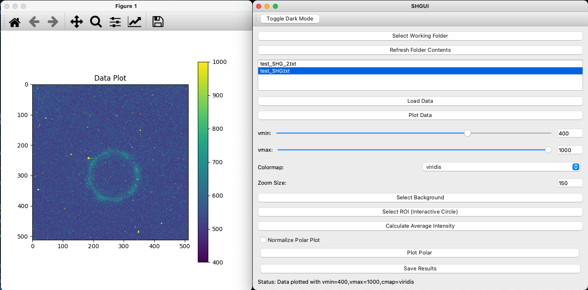
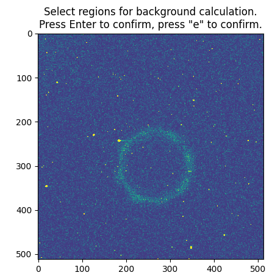
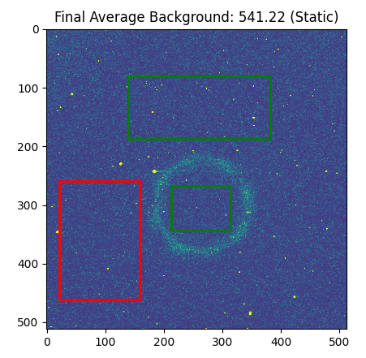
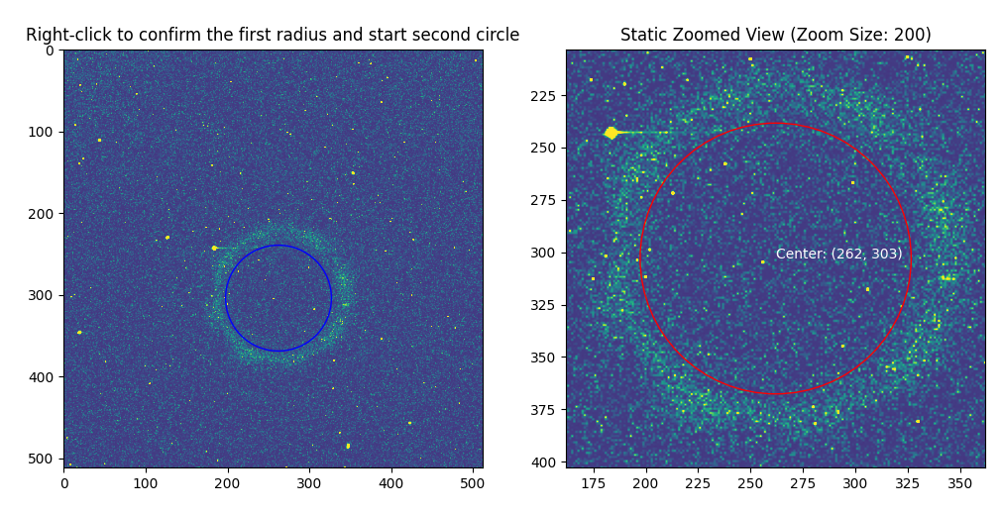

# SHGUI - Second Harmonic Generation Analysis Tool

SHGUI is a desktop application/excutable python script developed to facilitate the analysis of Second Harmonic Generation (SHG) data. It provides a graphical interface that allows users to interactively load, visualize, analyze, and save SHG data. The tool is built using Python and PyQt5 for the graphical interface and integrates the functionality of the `DataPlotter` analysis class.

## Features
- **Load SHG Data**: Easily load SHG data files (.tiff, .txt, .csv, .sif) for analysis.
- **Interactive Data Visualization**: Plot data with customizable options for color map (`cmap`), intensity range (`vmin`, `vmax`), and zoom size.
- **Background and ROI Selection**: Select background and region of interest (ROI) interactively with the GUI.
- **Calculate Average Intensity**: Perform bin size selection and ROI intensity integration.
- **Polar Plotting**: Plot data as a function of angle to understand SHG response characteristics.
- **Dark/Light Mode Toggle**: Switch between light and dark modes for comfortable viewing.
- **Save Analysis Results**: Save all calculated results, including different bin sizes, for further analysis.

## Getting Started

### Prerequisites
- Python 3.8 or higher
- PyQt5
- Matplotlib
- NumPy
- Pandas
- Scipy
- Skimage
- sif_parser

To install the necessary dependencies, run:
```sh
pip install PyQt5 matplotlib numpy pandas scipy skimage sif_parser
```

### Installation
Clone the repository:
```sh
git clone https://github.com/TedMercer/SHGUI.git
```
Navigate into the directory:
```sh
cd SHGUI
```
Run the application:
```sh
python SHGUI.py
```

### Creating a Standalone Executable
To create a standalone executable for SHGUI:
```sh
pyinstaller --onefile --windowed SHGUI.py
```
If you wish to have an icon that is provided use:
```sh
pyinstaller --onefile --windowed --icon=SHGUI_icon.png SHGUI.py
```
The executable will be found in the `dist` folder.

## How to Use SHGUI
1. **Select a Working Folder**: Use the "Select Working Folder" button to select the folder where your data files are located.
2. **Load Data**: Choose a file from the list and click "Load Data".
3. **Plot Data**: Customize the visualization by adjusting `vmin`, `vmax`, and selecting a `cmap` from the dropdown.
4. **Select Background and ROI**: Use the interactive features to select background and regions of interest.
5. **Calculate and Plot Intensity**: Perform intensity integration over the selected ROI and plot polar data.
6. **Save Results**: Save all your analysis results to a designated folder.

## Example of images in the GUI
When you first run the executable the script will run and open a python application window and display the following:

Next the user will be prompted to select the working directory and load in the file they wish to analyze. The status bar at the bottom is constantly giving feedback to each action. The user can then plot the data by selecting the colormap theme and the vmax and vmin values. When plotting a figure will be displayed:

Following the inital visualization the user then will be prompted to select the background signal and ROI. First the background which is done by selecting a region and pressing the "Enter" or "return" key based on keyboard config. When all the relevant regions are selected the user can press "e" to exit which will display the final background value on the static plot. Here you see the 3 prompts given and see how the user did not confirm the last region of the third plot as it's border remained red. 


Selecting the ROI The user must first select the center of the SHG signal. This center will then be zommed on by the set zoom value. Confirming the click is with the left click to select and right click to confirm. Process is illustrated with the below figure.

Following the user should press the "Calculate Average Intensity" button which will prompt a bin size (which is the bin size in degrees the user wishes to bin the data by -- this will be saved in the .txt file). After this it will display a x,y plot of the integrated data with the background subtracted and binned. This will also update the available data to be plotted and saved.

Following this the user can do a polar plot of the data and compare data sets easily by selecting then in the list.

Once complete all the data can then be saved to a txt file for further analysis.
<hr>

## Creating a Desktop shortcut
The repo contains a folder titled: **Desktop_shortcuts** this has two different files. One for windows and one for mac/linux. The windows usage is straight forward and requires the user to adjust the path in the folder to their path to the folder. Then if they wish to move it to their direct desktop it becomes then an executable application that can be clicked on. <br>
Macos and linux become more complex....

**Step 1:** Make the .sh File Executable
Open a Terminal and navigate to the directory where your .sh file is located (if it's on the desktop, run cd ~/Desktop).

Run this command to make the .sh file executable:

```bash
chmod +x your_script.sh
Replace your_script.sh with the actual name of your script.
```

**Step 2:** Create a Desktop Shortcut (macOS and Linux)
*For macOS:*
Open Automator (found in Applications > Utilities).

Create a new Application.

In the search bar, type Run Shell Script, then drag Run Shell Script into the workflow area.

In the shell script box, enter the full path to your .sh file. For example:

```bash
~/Desktop/your_script.sh
```

Save the Automator application to your desktop with a name like Run Script. You can now double-click this application to run your .sh script.

**For Linux:**
Right-click on the desktop, select Create New Launcher (this may be different based on your desktop environment).

In the launcher settings:

Name: Enter a name for your script, like Run Script.
Command: Enter the full path to your .sh file. For example:

```bash
/home/yourusername/Desktop/your_script.sh
```

Terminal: Check the box to run in a terminal if you need to see output.
Save the launcher. You can now double-click it to execute the script.

## DataPlotter Analysis Class
The `DataPlotter` class is responsible for the core analysis functionalities. Below are the methods available:

### Methods
- **`load_data(file_path)`**: Loads SHG data from the specified file.
- **`plot_data(vmin, vmax, cmap)`**: Plots the loaded data with specified visualization settings.
- **`background()`**: Allows interactive selection of background regions.
- **`interactive_circle_selection()`**: Allows interactive ROI selection.
- **`calculate_average_intensity(bin_size)`**: Calculates average intensity within the ROI based on the selected bin size.
- **`polar_plot()`**: Plots the calculated intensity as a function of angle.
- **`save_txt(folder_path, description)`**: Saves the analysis results to the specified folder.

## Example Usage
Here's an example of how to use the `DataPlotter` class programmatically:
```python
from SHG_Analysis_class import DataPlotter

# Create an instance of DataPlotter
data_plotter = DataPlotter()

# Load data
file_path = 'path/to/your/data.tiff'
data_plotter.load_data(file_path)

# Plot data with visualization options
data_plotter.plot_data(vmin=0, vmax=100, cmap='viridis')

# Select background and ROI
data_plotter.background()
data_plotter.interactive_circle_selection()

# Calculate and plot intensity
data_plotter.calculate_average_intensity(bin_size=10)
data_plotter.polar_plot()

# Save results
data_plotter.save_txt('path/to/save/results', 'SHG analysis results')
```

## Contributing
Contributions are welcome! Feel free to open an issue or submit a pull request.

### To Do...
This project is closing in on V1.0 and feels quite robust in combination with the [SHG_Contol_Center](https://github.com/TedMercer/DeLTA_SHG_Control_Center) repo. 

## Contact
For questions or suggestions, please contact [e.mercer@northeastern.edu].